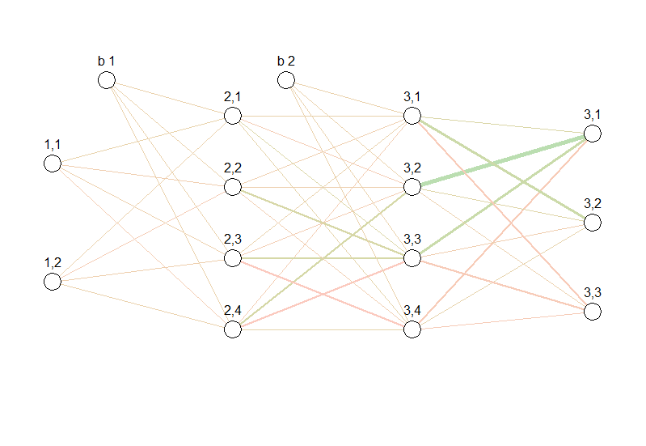

```{r, include = FALSE}
knitr::opts_chunk$set(
  collapse = TRUE,
  comment = "#>"
)
```

```{r setup}
library(NeuralNetwork)
```
## Functionality
This package provides functionality to built user-defined feedforward Neural Networks for classification and regression
<br>
You can

* use different activation functions
* choose between different algorithms
* split data into test- and trainsets
* evaluate the results
* visualize the Neural Network

<br>


# Usage

## 1. Create a Neural Network 

First you have to create a Neural Network.


This will generate a Neural Network for classification with two input nodes, two output nodes and two hidden layers with four nodes each:

`nn <- NeuralNet$new(c(2,4,4,2), category = "classification")`

<br>

This will generate a Neural Network for regression using the predefined sigmoid function as
activation function:

```
nn <- NeuralNet$new(c(2,4,4,1), activationfct = "sigmoid", 
                    category = "regression")
```


## 2. Configure Optimizer

You can choose between three optimizer algorithms:

* Stochastic Gradient Descent 

* Stochastic Gradient Descent with Momentum

* Nesterov accelerated gradient

This will generate a Stochastic Gradient Descent with Momentum Optimizer with a learning_rate of 0.0005, regularization_rate of 0 and a momentum_term of 0.9:
 
`optimizer <- OptimizerMomentum$new(0.0005, 0, 0.9)`

<br>

The previous set values can be changed:
```
   optimizer$setLearningRate(0.0001)
   optimizer$setRegularizationRate(0.00001)
   optimizer$setMomentumTerm(0.8)
```

## 3. Create a Trainer
The trainer class manages the training and the testing process of a given network for a given optimizer.


This generates a trainer:
```
trainer <- Trainer$new(nn, optimizer)

```

If you want, you can already give the trainer the training data and the test data
that you want to use. The training data and the test data each have to be lists
in the format that you can see below.

```
training_data <- list(
    list(input = 1:784, expectedOutput = 2),
    list(input = 784:1, expectedOutput = 10) # ,
    # ...
)
test_data <- list(
    list(input = 1:784 * 2, expectedOutput = 1) # ,
    # ...
)
trainer <- Trainer$new(nn_cls, optimizer,
                       training_data,
                       test_data))
```


## 3. Prepare Data

Load and save dataset(we use <https://en.wikipedia.org/wiki/MNIST_database>):

```
devtools::load_all("./R/")
mnist_folder <- "./mnist/"
```
Bring data in an usable format, declares test- and trainsets:

```
mnist <- MNIST$new(training_labels_fn = str_c(mnist_folder, "train-labels.idx1-ubyte"),
                   training_images_fn = str_c(mnist_folder, "train-images.idx3-ubyte"),
                   test_labels_fn = str_c(mnist_folder, "t10k-labels.idx1-ubyte"),
                   test_images_fn = str_c(mnist_folder, "t10k-images.idx3-ubyte"))

```

## 4. Training

The trainer class manages the training and the testing process of a given network for a given optimizer.


This generates a trainer:
```
trainer <- Trainer$new(nn, optimizer, NULL, NULL)

```
Split into test- and trainset:
```
trainer$separateData(c(mnist$training_data, mnist$test_data))

```

Examples of training with different parameters:
```
trainer$train(1, use_early_stopping = T,
              es_test_frequency = 1000, es_test_size = 100,
              es_minimal_improvement = -0.05)
trainer$train(1, use_early_stopping = T,
              es_test_frequency = 1000, es_test_size = 100,
              es_minimal_improvement = -0.02)
trainer$train(1, 500)
trainer$train(1, 1000)
trainer$train(1, 100)
```

Evaluate the neural network on the first n (here 500) elements of the test dataset: 
```
trainer$test(500)

```
Swap the currently used neural network with the copy of the neural network, that scored the best:

```
trainer$swapWithBestNeuralnet()

```
Change the previous set Neural Network:
```
trainer$setNeuralnet(nn)

```

## 5. Visualization

This will give you a visualization of the Neural Network:

```
nn$plot()

```

